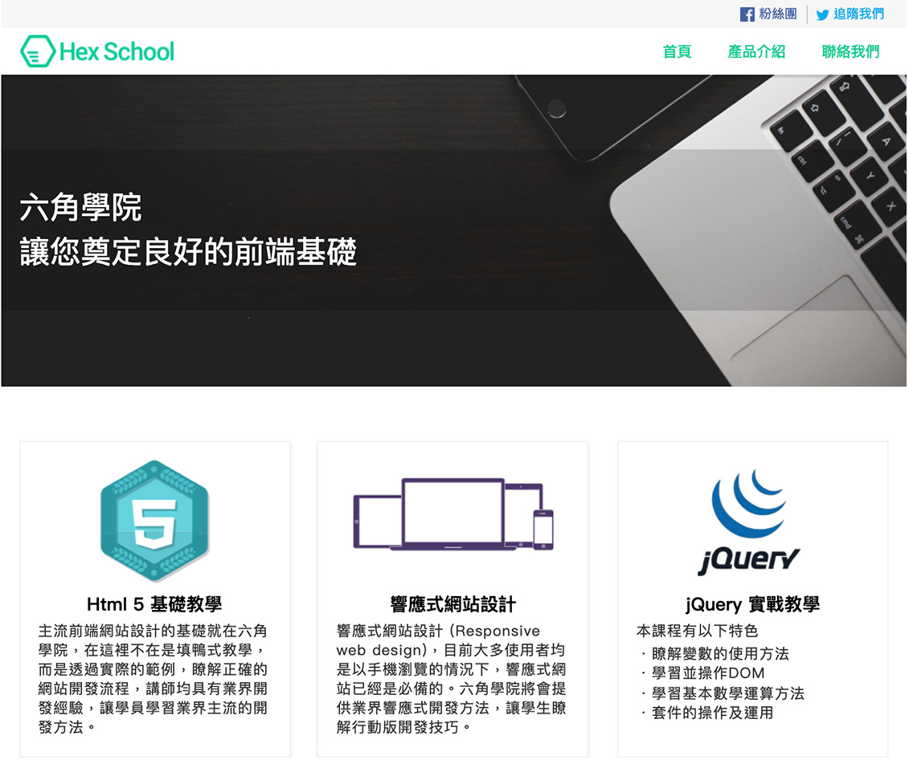

## 概述
這是六角學院的`使用HTML、CSS 開發一個網站`課程的最後作業
課程給了我一個psd檔，使用photoshop打開，裁切出自己要的圖，測量各個元素的邊距和大小，規畫整個網頁的layout。

整個原始碼只使用了HTML和CSS的語法，CSS在做layout的時候沒有用flex、grid等較先進的屬性，而只使用float、position這一些屬性來排版，因為我的主要目的是熟悉基本HTML、CSS的使用。

### 過程中注意以下這些細節
1. HTML TAG 是否使用的有意義
2. head 資訊填清楚
3. class 名稱取的易懂
4. 網頁結構規畫
5. 兼容熱門瀏覽器
6. 行內與區塊元素
7. margin, padding 觀念運用
8. float, position 運用
9. 表格表單設計
10. hover, focus 狀態設計
11. 文字排版
12. CSS background
13. CSS 圓弧, 陰影, 漸層
14. 切圖類型(JPG, GIF, PNG)

### 遇到的問題
在做這個網頁的過程中我遇到一些問題
* 文字和圖片在同一行時，沒有對齊置中
* 當三個block元素在同一個row裡面並排時，高度要如果對齊

### 結果
做完這個專案，讓我對HTML、CSS的使用更加的熟悉
學到的東西包含了
* header 之中的meta資訊，給seo使用的，還有節合open graph protocol，讓網站被分享時能有清楚的preview
* 靈活的使用float元素
* position 的使用
* 正確的清除float造成的container高度問題
* 語意化的html tag 設計

