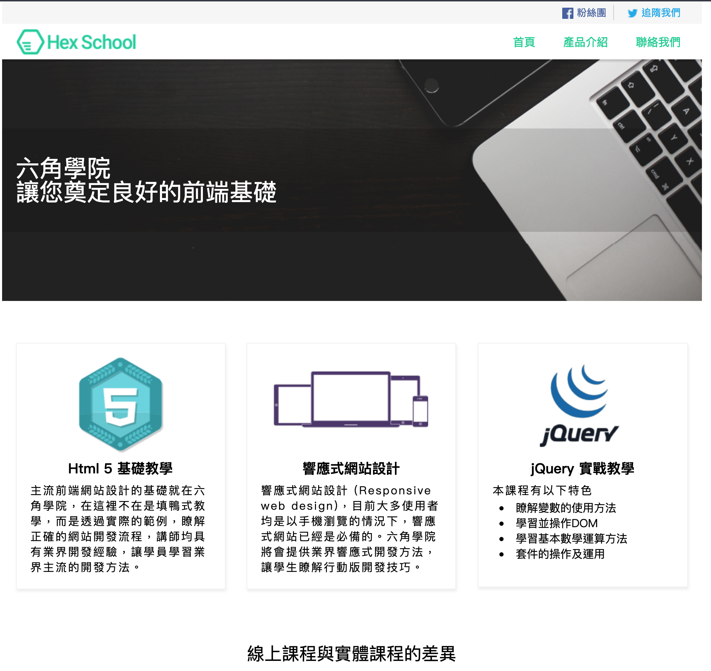

# HTMLCSS-Final-Homework
從一個PSD檔開始，自行切圖，然後用HTML、CSS來完成整個版。

六角學院的`使用HTML、CSS 開發一個網站`課程的最後作業
從拿到一個psd檔後，先用photoshop打開
然後開始出要的圖
測量各個元素的邊距和大小
規畫整個網頁的layout

過程中注意使用
1. HTML TAG 是否使用的有意義
2. HEAD 資訊填清梵
3. Class 名稱取的易懂
4. 網頁結構規畫
5. 兼容熱門瀏覽器
6. 行內與區塊元素
7. Margin, Padding 觀念運用
8. Float, Position 運用
9. 表格表單設計
10. hover, focus 狀態設計
11. 文字排版
12. CSS background
13. CSS 圓狐, 陰影, 漸層
14. 切圖類型(JPG, GIF, PNG)

